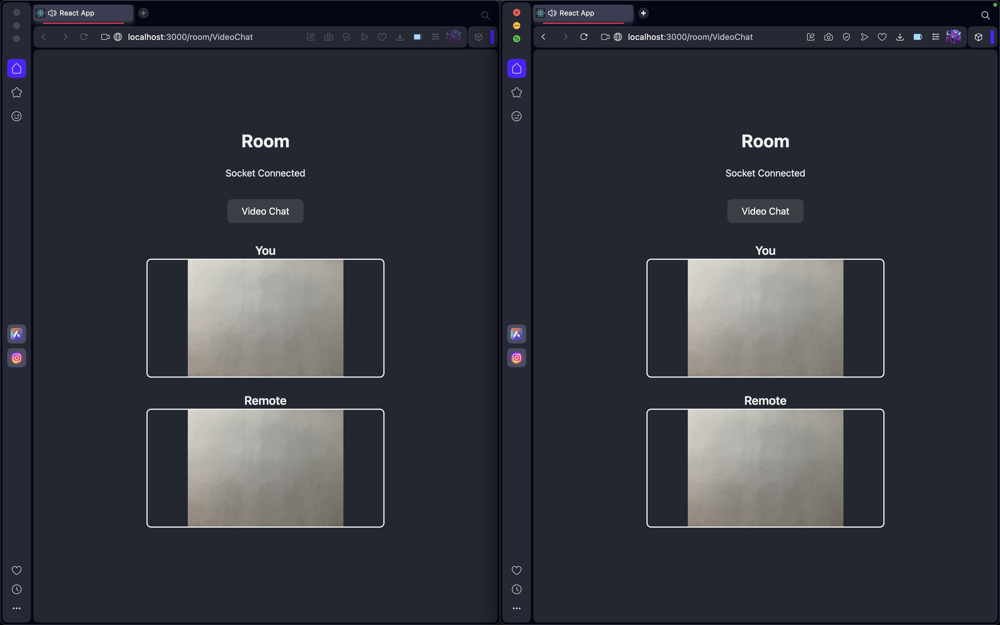

# Room Video Chat Using WEBRTC

Welcome to the Room Video Chat Using WEBRTC repository! This project is a real-time video chatting application developed using WebRTC and WebSockets technologies. It allows users to have video calls with others in real-time by joining a virtual room.

Website Live on: [https://roomvideochat.netlify.app](https://roomvideochat.netlify.app)

## Features

- **Real-Time Video Calls:** The Room Video Chat App enables users to have real-time video calls with others by joining a virtual room.
  
- **WebRTC Technology:** Leveraging WebRTC for peer-to-peer video and audio streaming, ensuring low latency and high-quality video calls.
  
- **WebSocket Communication:** Real-time communication between users is facilitated through WebSocket technology, enabling instant messaging and connectivity.
  
- **Responsive UI:** The application features a user-friendly and responsive interface built with React and styled using TailwindCSS for a smooth user experience.

## Getting Started

To set up and run the Room Video Chat App on your local machine, follow these steps:

1. Clone this repository
2. Navigate to the project directory: `cd Room-Video-Chat-WebRTC`
3. Install dependencies for the backend: `npm install`
4. Install dependencies for the frontend: `cd client && npm install`
5. Start the backend server: `npm start`
6. Start the frontend development server: `cd client && npm start`

Open your browser and visit `http://localhost:3000` to access the application.

## Technologies Used

- **Node.js:** Backend server runtime environment.
  
- **Socket.IO:** Library for real-time, bidirectional communication between clients and servers.
  
- **React:** JavaScript library for building user interfaces.
  
- **WebRTC:** Real-time communication protocol for peer-to-peer audio, video, and data transfer.
  
- **TailwindCSS:** Utility-first CSS framework for styling the user interface.

## Screenshots

### Home Page

### Room Interface

### Room Connected Interface

### Room Video Chat Interface

## Contributions

Contributions to enhance and improve the Room Video Chat App are welcome. If you're interested in contributing, follow these steps:

1. Fork the repository.
2. Create a new branch for your feature or bug fix: `git checkout -b feature/your-feature-name`.
3. Make your changes and commit them: `git commit -m 'Add your feature'`.
4. Push to your branch: `git push origin feature/your-feature-name`.
5. Open a pull request.

## Feedback and Issues

We value your feedback and welcome bug reports or suggestions for improvement. If you encounter any issues or have ideas for enhancements, please [open an issue](https://github.com/Mahendran-Murugan/Room-Video-Chat-WebRTC/issues).

Thank you for exploring the Room Video Chat App project! We hope it enhances your communication experience.
